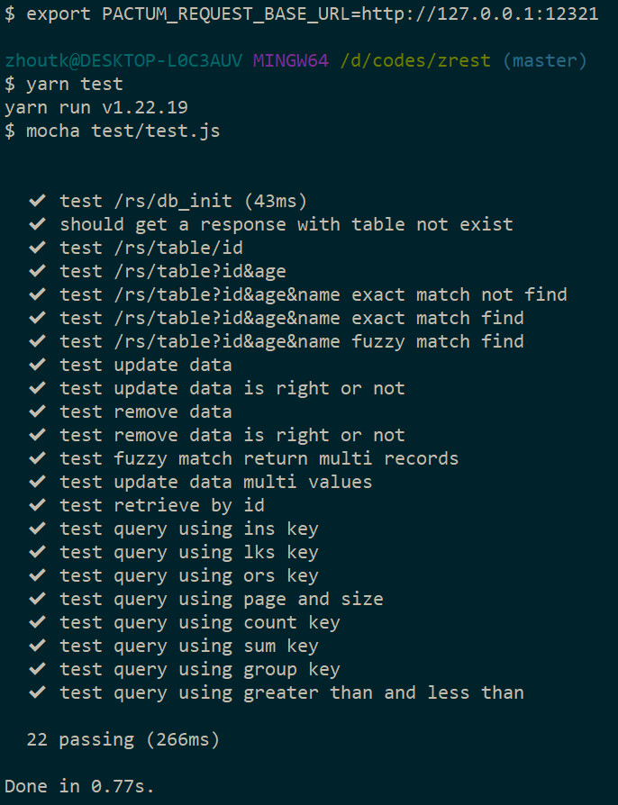

# Zrest    &emsp;&emsp;  [中文介绍](README_CN.md)  

## Introduce
A rest api rapid devlopment framework using node.js & C++ addon with cmake & cmake.js. Supporting sqlite3, mysql & postgres, Crossing windows, linux & macos.

## Related items
- [gels](https://github.com/zhoutk/gels)  A framework, which use koa2, mysql & typescript , building a rest api service.
- [Zjson](https://github.com/zhoutk/zjson)  json in c++
- [Zorm](https://github.com/zhoutk/zorm)  A orm for sqlite3, mysql, postgres in c++

## Technology selection
- node.js >= 16，c++ addon managed by cmake.js
- c++ 17， use cmake
- qlit3 - c api v3.40.1
- mysql - c api MySQL Connector C 6.1）
- postgres - c api (pgsql14)

## Table of Contents
- [Introduce](#introduce)
- [Related items](#related-items)
- [Technology selection](#technology-selection)
- [Table of Contents](#table-of-contents)
- [Run guidance](#run-guidance)
- [Project structure](#project-structure)
- [Database interface design](#database-interface-design)
- [Router default](#router-default)
- [Middleware](#middleware)
- [restful\_api](#restful_api)
- [Appoint router](#appoint-router)
- [Intelligent query](#intelligent-query)
- [Advanced operations](#advanced-operations)
- [Plans](#plans)

## Run guidance

- create config file，./src/config/configs.ts， assign database：
    ```
    export default {
        inits: {
            directory: {
                run: false,
                dirs: ['public/upload', 'public/temp']
            },
            socket: {
                run: false
            }
        },
        port: 12321,
        db_dialect: 'sqlite3',              //select the database, not support sqlite3, mysql and postgres
        db_options: {
            DbLogClose: false,              //show sql or not
            parameterized: false,           //Whether to perform parameterized query
            db_host: '192.168.0.12',
            db_port: 5432,
            db_name: 'dbtest',
            db_user: 'root',
            db_pass: '123456',
            db_char: 'utf8mb4',
            db_conn: 5,
            connString: ':memory:',         //memory running model
        }
    }
    ```
- run command in Terminal
    ```
    git clone https://gitee.com/zhoutk/zrest
    cd ztest
    npm i -g yarn
    yarn global add typescript eslint nodemon
    yarn
    tsc -w          //or command + shift + B， tsc:watch
    yarm configure
    yarn compile    //compile c++ addon
    yarn start      //or node ./dist/index.js
    export PACTUM_REQUEST_BASE_URL=http://127.0.0.1:12321
    yarn test       //run rest api test，Please check the test file carefully. There is a fairly complete method of using.   
                    //modify config to change database. Please create db named dbtest when use mysql or postgres.
    ```
- test result
run test log

service log（include request and sql）


## Project structure

```
|-- CMakeLists.txt
|-- addon                       //c++ addon
|   |-- export.cc
|   |-- index.cc
|   `-- index.h
|-- package.json
|-- src                         //node.js core source
|   |-- app.ts
|   |-- config
|   |   |-- configs.ts
|   |   `-- log4js.ts
|   |-- dao
|   |   `-- db_init.ts
|   |-- db
|   |   `-- baseDao.ts
|   |-- globals.d.ts
|   |-- index.ts
|   |-- inits
|   |   |-- enums.ts
|   |   |-- global.ts
|   |   `-- index.ts
|   |-- middlewares
|   |   |-- bodyParser.ts
|   |   |-- conditional.ts
|   |   |-- cors.ts
|   |   |-- etag.ts
|   |   |-- globalError.ts
|   |   |-- logger.ts
|   |   |-- rewrite.ts
|   |   |-- router
|   |   |   `-- index.ts
|   |   |-- session.ts
|   |   `-- static.ts
|   `-- routers
|       |-- index.ts
|       `-- router_rs.ts
|-- test                        //rest api test
|   `-- test.js
|-- thirds                      //third c++ projects
|   |-- MySQL-C-Api-6.1
|   |-- pgsql
|   |-- sqlit3
|   |-- zjson
|   `-- zorm
`-- tsconfig.json
```

## Database interface design  
- Database interface，c++ describing
    ```
    namespace ZORM
    {
        using std::string;
        using std::vector;
        using namespace ZJSON;
        class ZORM_API Idb
        {
        public:
            virtual Json select(string tablename, Json &params,
                                vector<string> fields = vector<string>(),
                                Json values = Json(JsonType::Array)) = 0;
            virtual Json create(string tablename, Json &params) = 0;
            virtual Json update(string tablename, Json &params) = 0;
            virtual Json remove(string tablename, Json &params) = 0;
            virtual Json querySql(string sql, Json params = Json(),
                                Json values = Json(JsonType::Array),
                                vector<string> fields = vector<string>()) = 0;
            virtual Json execSql(string sql, Json params = Json(),
                                Json values = Json(JsonType::Array)) = 0;
            virtual Json insertBatch(string tablename, Json &elements, string constraint = "id") = 0;
            virtual Json transGo(Json &sqls, bool isAsync = false) = 0;
        };
    }
    ```

## Router default
- /rs/:table[/:id]，support four restful request method, GET, POST, PUT, DELELTE

## Middleware
- globalError，global error process middleware
- logger，integrate log4js
- session，use jsonwebtoken realization

## restful_api
- [GET] /rs/users[?key=value&...],  List query, supporting various intelligent queries
- [GET] /rs/users/{id},   single record query
- [POST] /rs/users,   create record
- [PUT] /rs/users/{id},   modify the record where id={id}
- [DELETE] /rs/users/{id}, delete the record where id={id}

## Appoint router
- analysis the tablename from params，find whether the same name exist or not in dao catagory，load it if exist.
- if not exist，to find v_tablename view. request rewrite to the view.
- if not find the view，load BaseDao，providing base intelligent queries
  
  Therefore, the requirements that cannot be fulfilled by intelligent queries can be realized by using views or by performing custom actions in the dao directory. 

## Intelligent query
> Query reserved words：fields, page, size, sort, fuzzy, lks, ins, ors, count, sum, group

- fields : Define the query result fields, and support array and comma separated string
    ```
    example：       /rs/users?username=white&age=22&fields=["username","age"]
    generate sql：   SELECT username,age FROM users  WHERE username = ?  and age = ?
    ```
- page:  Paging parameters
- size
- sort:  Query Result Sorting Parameters
    ```
    example：       /rs/users?page=1&size=10&sort=age desc
    generate sql：  SELECT * FROM users  ORDER BY age desc LIMIT 0,10
    ```
- fuzzy:  Fuzzy query switch parameter, if not provided, it is accurate matching
    ```
    example：       /rs/users?username=i&password=1&fuzzy=1
    generate sql：  SELECT * FROM users  WHERE username like ?  and password like ?
    ```
- ins:  in query, one field for multiple values, for example:
    ```
    example：       /rs/users?ins=["age",11,22,26]
    generate sql：  SELECT * FROM users  WHERE age in ( ? )
    ```
- ors:  or query, multiple fields to multiple values, null value query are supported, for example:
    ```
    example：       /rs/users?ors=["age",1,"age",22,"password",null]
    generate sql：  SELECT * FROM users  WHERE  ( age = ?  or age = ?  or password is null )
    ```
- lks:  fuzzy or query, multiple fields to multiple values, null value query are supported, for example:
    ```
    example：       /rs/users?lks=["username","i","password",null]
    generate sql：  SELECT * FROM users  WHERE  ( username like ?  or password is null  )
    ```
- count:  count query，for example：
    ```
    example：       /rs/users?count=["1","total"]&fields=["username"]
    generate sql：  SELECT username,count(1) as total  FROM users
    ```
- sum:  sum query，for example:
    ```
    example：       /rs/users?sum=["age","ageSum"]&fields=["username"]
    generate sql：  SELECT username,sum(age) as ageSum  FROM users
    ```
- group:  group query，for example:
    ```
    example：       /rs/users?group=age&count=["*","total"]&fields=["age"]
    generate sql：  SELECT age,count(*) as total  FROM users  GROUP BY age
    ```

> Unequal operator query suppor

support ：>, >=, <, <=, <>, = ；Comma is the separator. One field supports one or two operations.
Special features: use "=" to enable a field to skip the fuzzy influence, so that fuzzy matching and exact matching can appear in a query statement at the same time

- One operation for one field, for example:
    ```
    example：       /rs/users?age=>,10
    generate sql：  SELECT * FROM users  WHERE age> ?
    ```
- Two operation for one field, for example:
    ```
    example：       /rs/users?age=>,10,<=,35
    generate sql：  SELECT * FROM users  WHERE age> ? and age<= ?
    ```
- Use "=" to remove the fuzzy influence of the field, for example:
    ```
    example：       /rs/users?age==,22&username=i&fuzzy
    generate sql：  SELECT * FROM users  WHERE age= ?  and username like ?
    ```

## Advanced operations
- Add a new record (Add Authorization in header)
    - url
    ```
        [POST]/rs/users
    ```
    - header
    ```
        Content-Type: application/json
        token: eyJhbGciOiJIUzI1NiIsInR...
    ```
    - params input
    ```
        {
            "username":"bill",
            "password":"abcd",
            "age":46,
            "power": "[\"admin\",\"data\"]"
        }
    ``` 
    - params return
    ```
        {
            "status": 200,
            "message": "data insert success."
        }
    ```
- use execSql to Execute sql statements which is write manually, calling by the backend (G.ORM is global var， details in ./src/inits/global.ts)


    - for example:
    ```
        G.ORM.execSql("update users set username = ?, age = ? where id = ? ", ["gels","99","6"])
    ```
    - params return
    ```
        {
            "status": 200,
            "message": "data execSql success."
        }
    ```
- insertBatch, calling by the backend
    - for example:
    ```
        let params = [
                        {
                            "username":"bill2",
                            "password":"523",
                            "age":4
                        },
                        {
                            "username":"bill3",
                            "password":"4",
                            "age":44
                        },
                        {
                            "username":"bill6",
                            "password":"46",
                            "age":46
                        }
                    ]
        G.ORM.insertBatch('users', params)
    ```
    - params return
    ```
        {
            "status": 200,
            "message": "data batch success."
        }
    ```
- tranGo, calling by the backend
    - for example:
    ```
        let trs = [
                    {
                        table: 'users',
                        method: 'Insert',
                        params: {
                            username: 'zhou1',
                            password: '1',
                            age: 1
                        }
                    },
                    {
                        table: 'users',
                        method: 'Insert',
                        params: {
                            username: 'zhou2',
                            password: '2',
                            age: 2
                        }
                    },
                    {
                        table: 'users',
                        method: 'Insert',
                        params: {
                            username: 'zhou3',
                            password: '3',
                            age: 3
                        }
                    }
                ]
        G.ORM.transGo(trs)         
    ```
    - params return
    ```
        {
            "status": 200,
            "message": "data trans success."
        }
    ```

## Plans
- Continue to expand supported relational databases，for example：oracle，mssql etc.（weak demand and insufficient power）
- front demo，manage rest api，can create table, add power, create views, custom behavior（expect to implement it）
- Standard SQL statement generation tool（This project specially extracts functions, which can easily extract the generated SQL statements）
- General database management project（Does the front end use web or Qt?）