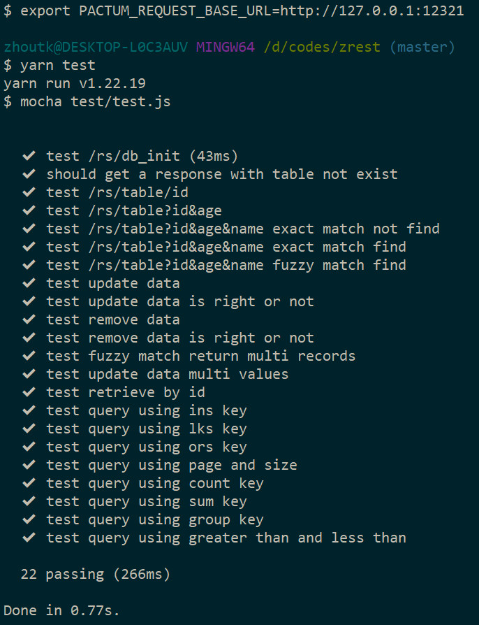
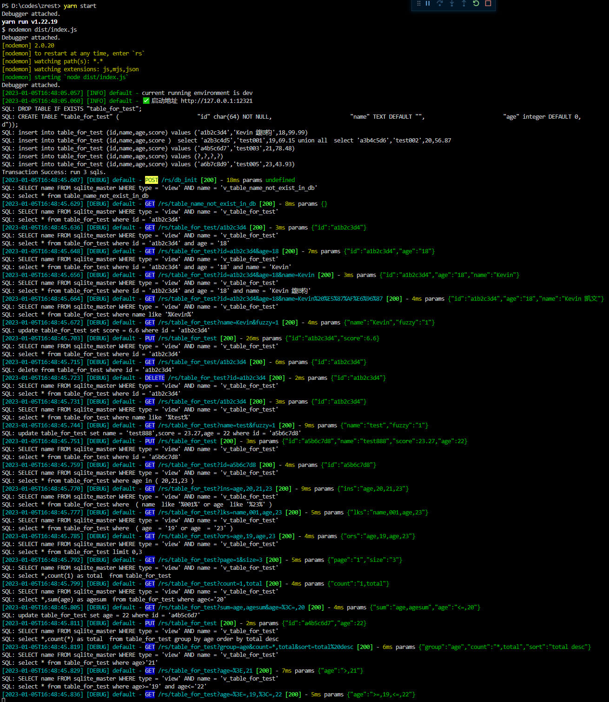

## 项目介绍   &emsp;&emsp;  [English](README.md)  
我将以往基于node.js与C++的相关项目结合起来，实现了一个微服务快速（rest api service）开发框架。该框架以关系数据库基础，现在支持（mysql、sqlite3、postgres），每建立一个数据表，就相当于自动实现了一组rest api，支持该表的增删改查、批量插入以及事务操作。并且查询功能支持很多高级操作，比如：in, sum, count, group等，且不用写任何SQL语句，查询语句会由前端提交的json对象自动转换成sql语句进行查询。  
当你建立好一个数据表，rest api就自动支持该表所有字段的精确匹配与模糊匹配查询两种模式。多表查询可以方便的由视图来实现，本项目使用了一个约定，若一个表，存在带v_的前缀视图，则运行该视图。即存在一个Users表，同时我们写了一个视图（v_Users），该视图关联了Users与Company表，则rest api中的Users相关查询会被自动映射到v_Users上。有了这种约定，加上权限控制，我们可以很方便的设计出多表联合查询接口。  
项目支持跨平台，同时支持windows, linux, macos

## 相关项目
- [gels](https://gitee.com/zhoutk/gels)  node.js项目，基于koa2实现的rest api服务框架，功能齐全; 以gels为入口，实现本项目，c++项目以插件方式集成
- [Zjson](https://gitee.com/zhoutk/zjson)  c++项目，实现简单高效的json处理
- [Zorm](https://gitee.com/zhoutk/zorm)  c++项目，以json对象为媒介，实现了一种ORM映射;设计了通用数据库操作接口规范，能无缝的在多种数据库之间切换

## 技术选择
- node.js 大于等于16，插件编写使用cmake.js方式
- c++ 17， 项目管理都使用cmake
- qlit3 官方的标准c实现，当前版本3.40.1
- mysql - c api （MySQL Connector C 6.1）
- postgres - c api(pgsql14)

## 内容目录
- [项目介绍](#项目介绍)
- [相关项目](#相关项目)
- [技术选择](#技术选择)
- [内容目录](#内容目录)
- [安装运行](#安装运行)
- [项目结构](#项目结构)
- [数据库接口设计](#数据库接口设计)
- [默认路由](#默认路由)
- [中间件](#中间件)
- [restful\_api](#restful_api)
- [约定路由解析流程](#约定路由解析流程)
- [智能查询](#智能查询)
- [高级操作](#高级操作)
- [未来计划](#未来计划)

## 安装运行 

- 新建配置文件，./src/config/configs.ts， 指定数据库：
    ```
    export default {
        inits: {
            directory: {
                run: false,
                dirs: ['public/upload', 'public/temp']
            },
            socket: {
                run: false
            }
        },
        port: 12321,
        db_dialect: 'sqlite3',              //数据库选择，现支持 sqlite3, mysql, postgres
        db_options: {
            DbLogClose: false,              //是否显示SQL语句
            parameterized: false,           //是否进行参数化查询
            db_host: '192.168.0.12',
            db_port: 5432,
            db_name: 'dbtest',
            db_user: 'root',
            db_pass: '123456',
            db_char: 'utf8mb4',
            db_conn: 5,
            connString: ':memory:',         //内存模式运行
        }
    }
    ```
- 在终端（Terminal）中依次运行如下命令
    ```
    git clone https://gitee.com/zhoutk/zrest
    cd ztest
    npm i -g yarn
    yarn global add typescript eslint nodemon
    yarn
    tsc -w          //或 command + shift + B，选 tsc:监视
    yarm configure  //windows下最低vs2019, gcc 7.5, macos clang12.0
    yarn compile    //编译c++插件, 若有问题，请参照 [Zorm](https://gitee.com/zhoutk/zorm) 文档，特别是最后的注释
    yarn start      //或 node ./dist/index.js
    export PACTUM_REQUEST_BASE_URL=http://127.0.0.1:12321
    yarn test       //运行rest api接口测试，请仔细查看测试文件，其中有相当完善的使用方法
                    //修改配置文件，可以切换不同的数据，运行测试；使用mysql或postgres时，请先手动建立dbtest数据，编码使用Utf-8
    ```
- 测试运行结果图
测试运行输出

项目日志（包括请求和sql语句）


## 项目结构

```
|-- CMakeLists.txt
|-- addon                       //c++插件封装
|   |-- export.cc
|   |-- index.cc
|   `-- index.h
|-- package.json
|-- src                         //node.js核心源码
|   |-- app.ts
|   |-- config
|   |   |-- configs.ts
|   |   `-- log4js.ts
|   |-- dao
|   |   `-- db_init.ts
|   |-- db
|   |   `-- baseDao.ts
|   |-- globals.d.ts
|   |-- index.ts
|   |-- inits
|   |   |-- enums.ts
|   |   |-- global.ts
|   |   `-- index.ts
|   |-- middlewares
|   |   |-- bodyParser.ts
|   |   |-- conditional.ts
|   |   |-- cors.ts
|   |   |-- etag.ts
|   |   |-- globalError.ts
|   |   |-- logger.ts
|   |   |-- rewrite.ts
|   |   |-- router
|   |   |   `-- index.ts
|   |   |-- session.ts
|   |   `-- static.ts
|   `-- routers
|       |-- index.ts
|       `-- router_rs.ts
|-- test                        //rest api 测试
|   `-- test.js
|-- thirds                      //依赖的c++项目
|   |-- MySQL-C-Api-6.1
|   |-- pgsql
|   |-- sqlit3
|   |-- zjson
|   `-- zorm
`-- tsconfig.json
```

## 数据库接口设计  
- 数据库操作接口，c++描述
    ```
    namespace ZORM
    {
        using std::string;
        using std::vector;
        using namespace ZJSON;
        class ZORM_API Idb
        {
        public:
            virtual Json select(string tablename, Json &params,
                                vector<string> fields = vector<string>(),
                                Json values = Json(JsonType::Array)) = 0;
            virtual Json create(string tablename, Json &params) = 0;
            virtual Json update(string tablename, Json &params) = 0;
            virtual Json remove(string tablename, Json &params) = 0;
            virtual Json querySql(string sql, Json params = Json(),
                                Json values = Json(JsonType::Array),
                                vector<string> fields = vector<string>()) = 0;
            virtual Json execSql(string sql, Json params = Json(),
                                Json values = Json(JsonType::Array)) = 0;
            virtual Json insertBatch(string tablename, Json &elements, string constraint = "id") = 0;
            virtual Json transGo(Json &sqls, bool isAsync = false) = 0;
        };
    }
    ```

## 默认路由
- /rs/:table[/:id]，支持四种restful请求，GET, POST, PUT, DELELTE，除GET外，其它请求检测是否授权

## 中间件
- globalError，全局错误处理中间件
- logger，日志，集成log4js，输出系统日志
- session，使用jsonwebtoken，实现鉴权；同时，为通过的鉴权的用户生成对应的session
    - 用户登录成功后得到的token，在以后的ajax调用时，需要在header头中加入token key

## restful_api
- [GET] /rs/users[?key=value&...], 列表查询，支持各种智能查询
- [GET] /rs/users/{id}, 单条查询
- [POST] /rs/users, 新增记录
- [PUT] /rs/users/{id}, 修改记录
- [DELETE] /rs/users/{id}, 删除记录

## 约定路由解析流程
- 解析参数中的tablename，查找dao目录下是否存在同名的接口实现，若存在加载这个实现
- dao目录下不存在自定义实现，查询是否存在v_tablename视图，若存在，目标重定向到视图上
- 不存在对应视图，加载BaseDao的基础实现，进行默认的智能查询  
  
  因此，智能查询不能完成的需求，可以使用视图或在dao目录下进行自定义行为来实现  

## 智能查询
> 查询保留字：fields, page, size, sort, fuzzy, lks, ins, ors, count, sum, group

- fields, 定义查询结果字段，支持数组和逗号分隔字符串两种形式
    ```
    查询示例：  /rs/users?username=white&age=22&fields=["username","age"]
    生成sql：   SELECT username,age FROM users  WHERE username = ?  and age = ?
    ```
- page, 分页参数，第几页
- size, 分页参数，每页行数
- sort, 查询结果排序参数
    ```
    查询示例：  /rs/users?page=1&size=10&sort=age desc
    生成sql：   SELECT * FROM users  ORDER BY age desc LIMIT 0,10
    ```
- fuzzy, 模糊查询切换参数，不提供时为精确匹配
    ```
    查询示例：  /rs/users?username=i&password=1&fuzzy=1
    生成sql：   SELECT * FROM users  WHERE username like ?  and password like ?
    ```
- ins, 数据库表单字段in查询，一字段对多个值，例：
    ```
    查询示例：  /rs/users?ins=["age",11,22,26]
    生成sql：   SELECT * FROM users  WHERE age in ( ? )
    ```
- ors, 数据库表多字段精确查询，or连接，多个字段对多个值，支持null值查询，例：
    ```
    查询示例：  /rs/users?ors=["age",1,"age",22,"password",null]
    生成sql：   SELECT * FROM users  WHERE  ( age = ?  or age = ?  or password is null )
    ```
- lks, 数据库表多字段模糊查询，or连接，多个字段对多个值，支持null值查询，例：
    ```
    查询示例：  /rs/users?lks=["username","i","password",null]
    生成sql：   SELECT * FROM users  WHERE  ( username like ?  or password is null  )
    ```
- count, 数据库查询函数count，行统计，例：
    ```
    查询示例：  /rs/users?count=["1","total"]&fields=["username"]
    生成sql：   SELECT username,count(1) as total  FROM users
    ```
- sum, 数据库查询函数sum，字段求和，例：
    ```
    查询示例：  /rs/users?sum=["age","ageSum"]&fields=["username"]
    生成sql：   SELECT username,sum(age) as ageSum  FROM users
    ```
- group, 数据库分组函数group，例：
    ```
    查询示例：  /rs/users?group=age&count=["*","total"]&fields=["age"]
    生成sql：   SELECT age,count(*) as total  FROM users  GROUP BY age
    ```

> 不等操作符查询支持

支持的不等操作符有：>, >=, <, <=, <>, =；逗号符为分隔符，一个字段支持一或二个操作。  
特殊处：使用"="可以使某个字段跳过fuzzy影响，让模糊匹配与精确匹配同时出现在一个查询语句中

- 一个字段一个操作，示例：
    ```
    查询示例：  /rs/users?age=>,10
    生成sql：   SELECT * FROM users  WHERE age> ?
    ```
- 一个字段二个操作，示例：
    ```
    查询示例：  /rs/users?age=>,10,<=,35
    生成sql：   SELECT * FROM users  WHERE age> ? and age<= ?
    ```
- 使用"="去除字段的fuzzy影响，示例：
    ```
    查询示例：  /rs/users?age==,22&username=i&fuzzy
    生成sql：   SELECT * FROM users  WHERE age= ?  and username like ?
    ```

## 高级操作
- 新增一条记录(header头中增加授权token)
    - url
    ```
        [POST]/rs/users
    ```
    - header
    ```
        Content-Type: application/json
        token: eyJhbGciOiJIUzI1NiIsInR...
    ```
    - 输入参数
    ```
        {
            "username":"bill",
            "password":"abcd",
            "age":46,
            "power": "[\"admin\",\"data\"]"
        }
    ``` 
    - 返回参数
    ```
        {
            "status": 200,
            "message": "data insert success."
        }
    ```
- execSql执行手写sql语句，供后端内部调用
    - 使用示例
    ```
        G.ORM.execSql("update users set username = ?, age = ? where id = ? ", ["gels","99","6"])
    ```
    - 返回参数
    ```
        {
            "status": 200,
            "message": "data execSql success."
        }
    ```
- insertBatch批量插入与更新二合一接口，供后端内部调用(G.ORM 为全局对象， 详见 ./src/inits/global.ts)
    - 使用示例
    ```
        let params = [
                        {
                            "username":"bill2",
                            "password":"523",
                            "age":4
                        },
                        {
                            "username":"bill3",
                            "password":"4",
                            "age":44
                        },
                        {
                            "username":"bill6",
                            "password":"46",
                            "age":46
                        }
                    ]
        G.ORM.insertBatch('users', params)
    ```
    - 返回参数
    ```
        {
            "status": 200,
            "message": "data batch success."
        }
    ```
- tranGo事务处理接口，供后端内部调用
    - 使用示例
    ```
        let trs = [
                    {
                        table: 'users',
                        method: 'Insert',
                        params: {
                            username: 'zhou1',
                            password: '1',
                            age: 1
                        }
                    },
                    {
                        table: 'users',
                        method: 'Insert',
                        params: {
                            username: 'zhou2',
                            password: '2',
                            age: 2
                        }
                    },
                    {
                        table: 'users',
                        method: 'Insert',
                        params: {
                            username: 'zhou3',
                            password: '3',
                            age: 3
                        }
                    }
                ]
        G.ORM.transGo(trs)         
    ```
    - 返回参数
    ```
        {
            "status": 200,
            "message": "data trans success."
        }
    ```

## 未来计划
- 继续扩展支持的关系数据库，如：oracle，mssql等（需求不强，动力不足）
- 写一个前端demo，管理rest api，能够建表，加权限，建视图，自定义行为（很期望实现它）
- 标准SQL语句生成工具（本项目专门提取了个函数，很容易提取生成的SQL语句）
- 通用数据库管理项目（前端用web还是Qt呢？）